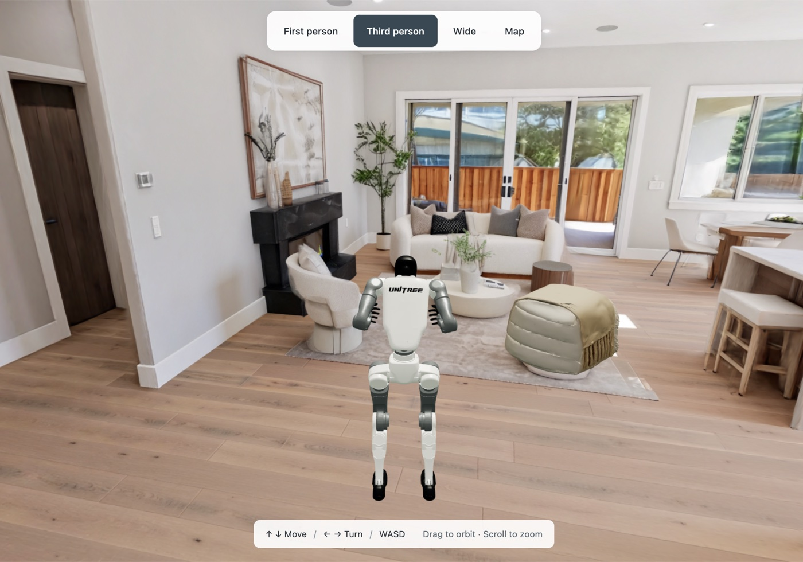
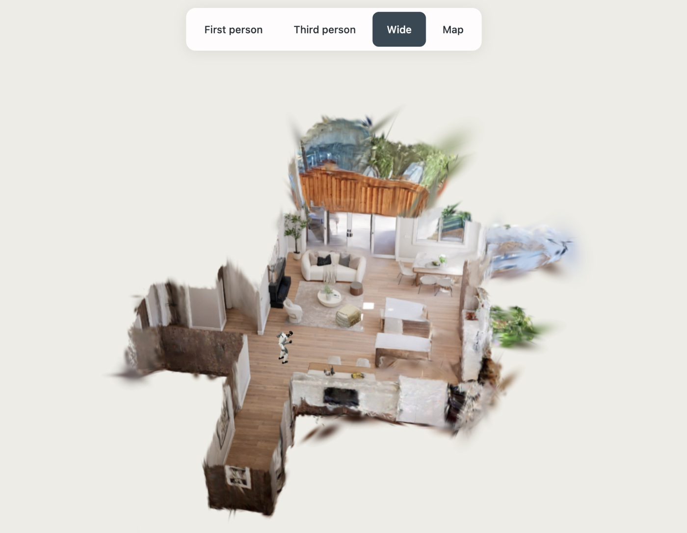
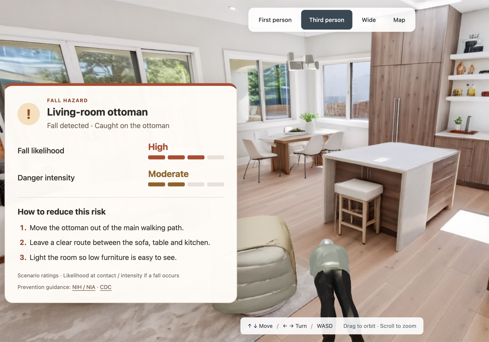

# STGS — Save the Grannys Simulation

**🥈 Second place · [Spatial Intelligence + Generative 3D Hackathon](https://luma.com/b101ml40)**<br>
Track 2: Physical AI & Simulation · September 5, 2026 · San Francisco<br>
Built by **Hai Bui, Katherine Wang, and Sean Tey**

STGS explores how interactive simulation can help identify potential household hazards and suggest ways to make homes safer for older adults.

Starting from photographs of a living space, we create an explorable 3D environment to examine how everyday objects and layouts affect movement and safety. The prototype demonstrates scenarios such as potential fall risks, using simulated interactions to illustrate hazards and present prevention recommendations informed by NIH and CDC guidance.

**We used World Labs’ Marble via Mint to generate photo-guided 3D environments as Gaussian splats with matching collision meshes, and Tripo to create objects for household hazard scenarios. These assets come together in Three.js with navigation and interactive characters.**

Thanks to **Founders Inc., Mint, Tripo, World Labs, and Convex** for supporting the event.

**[Presentation slides](https://canva.link/7pzzwal00fv0sf8)**

## Screenshots







## Demo

Explore the home, switch between Unitree and grandma, and encounter simulated hazards with explanations and prevention suggestions.


## How it works

- **Generate the environment:** Room photographs guide World Labs’ Marble, accessed via Mint, to produce Gaussian splats and matching collision meshes. Spark renders the splats inside Three.js.
- **Make it interactive:** Tripo-generated objects add controllable geometry for hazard scenarios. Navigation uses collision-derived data to guide movement, while Unitree and grandma share animation logic.
- **Explain the hazards:** Configured encounters trigger simulated responses and explanatory cards with scenario ratings and practical home-safety suggestions informed by NIH/NIA and CDC guidance.

The prototype uses approximate geometry and authored scenarios; its ratings are not clinically validated injury predictions.

## Run locally

Requires **Node.js 22.12+ or 24+**.

```sh
git clone https://github.com/haimcqueen/grandma_simulation.git
cd grandma_simulation/environment-sim/v2
npm ci
npm run dev
```

Open **http://127.0.0.1:5174/**. Environment assets stream automatically; no generation API keys are needed.

**Controls:** Arrow keys to move and turn · **A** to switch characters · **F/V/B/M** for camera views · **R** to reset.

The [two-floor walkthrough](http://127.0.0.1:5174/?house=1) is available as a separate scene.

See the [development guide](environment-sim/v2/README.md) for local asset downloads, additional scenes, tests, and integration details.
