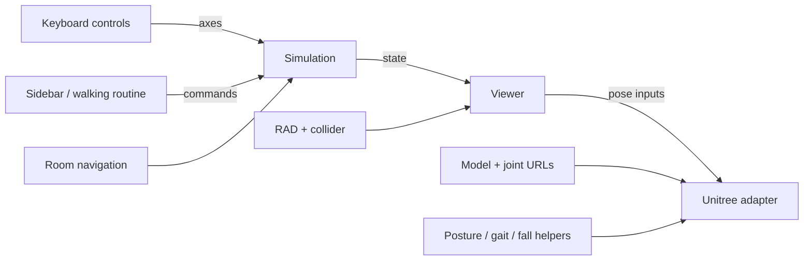

# Unitree in the realistic house: collaborator guide

**Hazards are integrated:** see the [hazard merge and reuse notes](HAZARD-INTEGRATION.md) for zone configuration, profiles, popups and validation.

Updated September 5, 2026.

## What ships

The working app is **`environment-sim/v2/`**. It places the team's articulated Unitree bodies inside the existing photo-guided World Labs room. The old floor-plan house is preserved in `environment-sim/v1-draft/`; its robot source and assets are shared dependencies, not a second simulation running inside v2.

| Feature | Current behavior |
| --- | --- |
| Bodies | G1 grandma, upright and toddler presets; H1 adult; Go2 crawl and trot |
| Movement | Arrow keys or WASD; forward/reverse, turning, acceleration and braking; route following and automatic tour |
| Cameras | First person follows the robot's eye/body orientation; third person follows behind with collider clearance |
| Posture and appearance | Posture intensity, five skins, body switching, configurable walking speed |
| Falls | Forward trip, backward slip and sideways fall for G1/H1, at the current room position |
| Playback | Pause, replay, reset; normal, half and quarter speed |
| Environment | Existing RAD appearance plus matching collider, conservative navigation grid, cart/barrier scenarios |
| Handoff/export | This guide, app/implementation docs, scenario JSON export and browser validation scripts |

**Stairs and upstairs are still missing in the realistic world.** V1 has a separate floor-plan reconstruction, continuous stair traversal and stair/balcony fall demos. Those scene coordinates do not align with the generated room and are deliberately absent from v2's supported scenarios. Reconstruct and register the stairs/upstairs, validate their collider and navigation, and then implement a floor transition in v2.

Falls and gait are authored demonstrations. Root movement respects the room grid; individual limbs do not have contact physics, ragdolls or stair foot IK. Go2 does not use the biped fall poses. The unrigged grandma figurine and garden remain separate v1 features.

## Run the app

Use Node 22.12+ or 24+. Clone the **whole repository**, because v2 imports shared robot code/assets from v1.

```sh
cd environment-sim/v2
npm ci
npm run dev
```

Open **http://127.0.0.1:5174/**. Vite uses a strict port so it cannot silently switch to another address. Stop an existing server on that address if necessary. During development a legacy app also listened on IPv6 `localhost`; the explicit IPv4 address avoids that ambiguity.

The checked-in manifest loads public room assets without generation credentials. To use local copies:

```sh
npm run fetch-world
```

Set `VITE_WORLD_MANIFEST_URL=/worlds/tantau-local.json` in `.env.local`, then restart. The downloaded world files and `.env.local` are Git-ignored. RAD appearance streams asynchronously; initialized metadata alone does not guarantee that room pixels have drawn yet.

### Keyboard reference

| Keys | Action |
| --- | --- |
| ↑ / ↓ or W / S | Forward / backward |
| ← / → or A / D | Turn left / right |
| F / V | First / third person |
| 1 / 2 / 3 / 4 / 5 | Grandma / adult / crawl / toddler / dog |
| [ / ] | Decrease / increase posture intensity |
| K | Cycle appearance |

Release movement keys to brake. Movement takes over from the automatic tour. Form fields consume their own editing keys; body selection blurs the dropdown so arrows can immediately drive. Pause, reset, blur and environment/body changes clear held keys. Grandma automatically falls and gets up at configured floor hazards during arrow/WASD or route movement; controls/routes resume after recovery. Explicit Play fall demos still require replay or reset. See the hazard guide for the toggle and module contract.

## Module map and ownership

Paths below are relative to `environment-sim/v2/` unless noted.

| Module | Owns | Reuse boundary |
| --- | --- | --- |
| `src/unitree.ts` | Public exports | Convenient entry point for another Vite scene |
| `src/robot-resident.ts` | Loading, posing and disposing one articulated body | Takes model/joint URLs; starts no loop, creates no camera and imports no world loader |
| `src/robot-assets.ts` | Bundled G1/H1/Go2 URLs | Replace with collaborator assets or pass URLs directly |
| `src/posture.ts` | Body, stance, gait, speed and scale presets | Add/tune a preset here |
| `src/keyboard-controls.ts` | Key capture, axes, focus handling and cleanup | Callback-based, independent of Three.js, page markup and Simulation |
| `src/falls.ts` | Supported room fall catalogue and timing | Uses relative tracks, never original house positions |
| `v1-draft/src/robot/fall-motion.ts` | Shared fall joint poses, orientation and ground tracks | No staircase, floor-plan, scene or DOM dependency |
| `src/simulation.ts` | Position, heading, route, gait phase, fall state, speed, pause and events | Only owner of movement and simulation time |
| `src/viewer.ts` | Camera, root placement, room layering and visual updates | Consumes simulation state; does not plan movement |
| `src/world-loader.ts` | Appearance, collider transforms, queries and disposal | One replaceable world resource |
| `src/scene-resources.ts` | Mesh resource cleanup | Shared utility without a World Labs dependency |
| `src/main.ts` | UI and the single fixed-step/render loop | Wires components together |



Keep a single simulation clock and render loop. Do not let GLB root motion, keyboard events or a second animation loop independently move the simulation root.

## Reuse the body in another scene

Inside a Vite app that can resolve this repository's modules:

```ts
import { loadRobotResident, defaultRobotAssets } from "./unitree";

const resident = await loadRobotResident("grandma", defaultRobotAssets.g1);
scene.add(resident.root);

// Called from YOUR existing loop. Values come from your movement controller.
function renderResident(state: {
  x: number; y: number; z: number; heading: number;
  time: number; distance: number; gaitPhase: number;
  walking: boolean; paused: boolean;
}) {
  resident.root.position.set(state.x, state.y, state.z);
  resident.root.rotation.y = state.heading;
  resident.setMotion("grandma", state.gaitPhase, 1, "factory");
  resident.setFall(null);
  resident.update(state.time, state.distance, state.walking, state.paused);
}

// Call on unmount: detach and dispose the component you own.
function disposeResident() {
  scene.remove(resident.root);
  resident.dispose();
}
```

The adapter returns `root`, `robot`, `metadata`, `setMotion`, `setFall`, `update` and `dispose`. Roots are feet-origin, Y-up, forward +Z. Position is in metres, heading in radians, time in seconds and gait phase in cycles. `setMotion` accepts `(posture, gaitPhase, postureIntensity = 1, skin = "factory")`. Advance phase from actual travel and the preset stride length; reverse travel reverses phase. `setFall` accepts `{ kind, elapsed, autoRecover?: boolean }` or `null`; the host owns its clock and root travel.

Use a preset matching the loaded rig. Changing G1 to H1/Go2 requires loading the matching body and joints, not merely changing the motion preset. Height-changing presets also require a reload. V2's body selector handles that transaction and preserves position, skin and pause state.

For a host that does not use Vite asset imports, import the adapter directly and supply ordinary URLs:

```ts
import { loadRobotResident } from "./robot-resident";

const resident = await loadRobotResident("adult", {
  modelUrl: "/my-assets/h1.glb",
  jointsUrl: "/my-assets/h1.joints.json",
});
```

The model must preserve the expected joint names and orientation; the JSON maps joint names to `{ axis, lower, upper }`. Arbitrary character GLBs need their own rig adapter. In the existing app, `viewer.loadRobot(posture, optionalAssetUrls)` uses the same API; `viewer.loadResident(...)` remains the separate matching idle/walk-clip adapter.

These are reusable source modules, not a published npm package. Copying only v2 is insufficient. A separate package would also need the imported robot, gait, crawl, stance, motion, livery and fall-motion modules, their asset provenance, and a consistent Three.js dependency. V2's Vite config deduplicates Three.js.

## Reuse keyboard input

```ts
import { createKeyboardControls } from "./keyboard-controls";

const input = createKeyboardControls(window, {
  canDrive: () => !simulation.paused && !simulation.fall,
  onDriveStart: () => simulation.setManual(),
  onClear: () => simulation.stopManualMotion(),
});

// In your existing fixed-step loop:
const { forward, turn } = input.sample();
simulation.drive(forward, turn, 1 / 60);
simulation.advance(1 / 60);

// Before pause/reset/environment changes:
input.clear();
// On unmount/HMR: removes all listeners and clears held keys.
input.dispose();
```

`sample()` returns axes in [-1, 1]. `onShortcut(event)` is optional and returns true when the host handles a shortcut. The host owns loading/fall guards, tour cancellation, camera choices and explicit state-change cleanup. Creating the input module does not start a timer or movement loop.

## Extend the environment or motion

- **Different appearance:** replace the world manifest or robot asset URLs. Keep transforms and units consistent.
- **Different layout:** rebake navigation and validate spawn/destination reachability; replacing appearance does not update collision data.
- **New posture/gait:** add a `posture.ts` preset and compatible rig. Keep speed, phase/stride and scale consistent.
- **New fall:** define a relative track and supported rig, add a room catalogue entry and test replay/pause/collision constraints. Add world-specific props and coordinates separately.
- **New floors:** add real geometry and a validated stair connection before exposing a floor selector. Do not transplant v1's coordinates into this room.

The current grid uses a 0.28 m radius / 1.7 m height envelope. H1 is capped at 1.7 m and toddler G1 at 0.95 m. Smaller presets retain that same conservative navigation region. Asset scale and unseen generated regions are approximate.

## Validation and review

```sh
cd environment-sim/v2
npm run build
npm test
# With the v2 server running at 127.0.0.1:5174:
npm run test:keyboard
npm run test:unitree
npm run test:falls
npm run test:combined
```

Browser checks use Playwright with installed Google Chrome. Set `BASE_URL` to use another server. They cover six body/movement presets, arrow movement in both camera modes, braking, focus/blur, reusable keyboard cleanup, posture/skin changes, falls, pause/replay/reset, routes, obstacles, room occlusion and mobile layout. The first-person fall check verifies actual rendered pixel variation before capturing the streamed room. Evidence goes to ignored `.artifacts/`.

The v2 simulation and hazard suites contain 27 tests, including automatic fall/recovery lifecycle and pose continuity. `npm run test:recovery` checks keyboard encounters and get-up in both camera modes. After extracting shared fall poses, v1's build and 32 focused fall/floor/manual/gait tests also passed. The earlier v1 full suite had an intermittent randomized swarm threshold failure; it was not changed or claimed fixed.

See also the [v2 app README](../environment-sim/v2/README.md), [implementation handoff](implementation/v2/README.md) and [house history](TEAM-HANDOFF-HOUSE.md). This guide is the current entry point for collaborators working on Unitree in the realistic environment.
